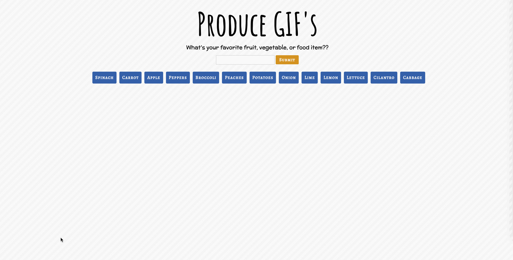
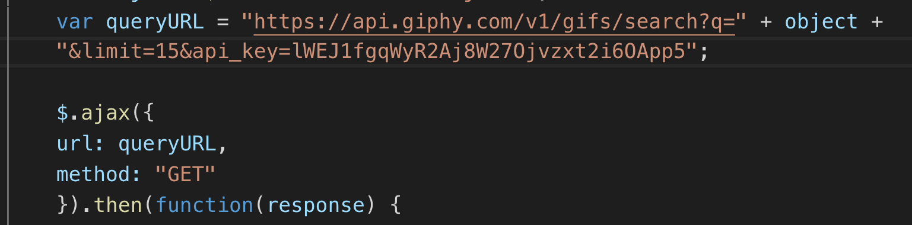

# GifTastic

I built a dynamic web page that uses an AJAX call to the GIPHY API. It populates static GIF's when a button is clicked and the user is then able to click on the GIPHY image to animate the GIF. 

## Live Link
https://shelbyreins.github.io/GifTastic/

## Description on how to use:

- Press on a button
- Static GIF's will appear
- To play the GIF, press on the GIPHY image
- To stop the GIF, press on the GIPHY image again
- Add a new button by typing in your favorite produce in the search 
- Once the button appears, repeat the previous steps
- Have fun!

    

### Game Design Notes

- When the user clicks a button, 10 static, non-animated GIF's should appear
- When user clicks on a still GIPHY image, the GIF will animate
- Each GIF should include the rating
- 

## Technologies Used

- HTML
- CSS
- Git
- Github
- JavaScript
- jQuery
- AJAX

    ### Code Snippet
  
    This code snippet illistrates an AJAX call. 

    
